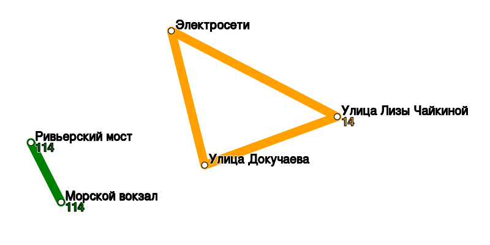

# Transport router

An intermediate project written on C++ during Yandex Praktikum course 

## Description
The Transport Router is a back-end application which helps to calculate an optimal route by public transport. Includes transport database:

For buses: name, type, stops

For stops: name, gps coord, list of distances to other stops (real length)

Based on these data the app can show route statistics like:

Request:

```json
{
    "stat_requests": [
        {
            "id": 1,
            "name": "289",
            "type": "Bus"
        }
    ]
}
```

Answer:

```json
[
    {
        "curvature": 1.63414,
        "request_id": 1,
        "route_length": 24490,
        "stop_count": 7,
        "unique_stop_count": 4
    }
]
```

All saved bus routes can be visualized in SVG format by request:

```json
{
    "stat_requests": [
        {
            "id": 1,
            "type": "Map"
        }
    ]
}
```

An answer is a text representation of svg file:
```json
[
    {
        "map": "<?xml version=\"1.0\" encoding=\"UTF-8\" ?>\n<svg xmlns=\"http://www.w3.org/2000/svg\" ... "
        ,
        "request_id": 1"
    }
]
```

An example:



A "Route" request generates the shortest route between two stops:

```json
{
      "type": "Route",
      "from": "Biryulyovo Zapadnoye",
      "to": "Universam",
      "id": 4
}
```

An answer:
```json
{
    "items": [
        {
            "stop_name": "Biryulyovo Zapadnoye",
            "time": 6,
            "type": "Wait"
        },
        {
            "bus": "297",
            "span_count": 2,
            "time": 5.235,
            "type": "Bus"
        }
    ],
    "request_id": 4,
    "total_time": 11.235
}
```

## Used language features
OOP, templates, patterns, method chaining, std algorithms, JSON, SVG, graphs.


## Build

CMakeLists.txt file is included for fast build with CMAKE. Only STL library is used.